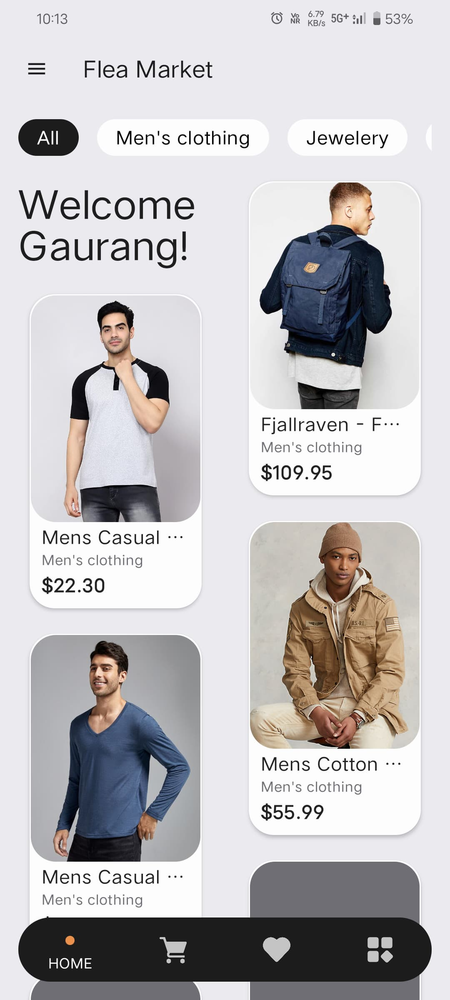
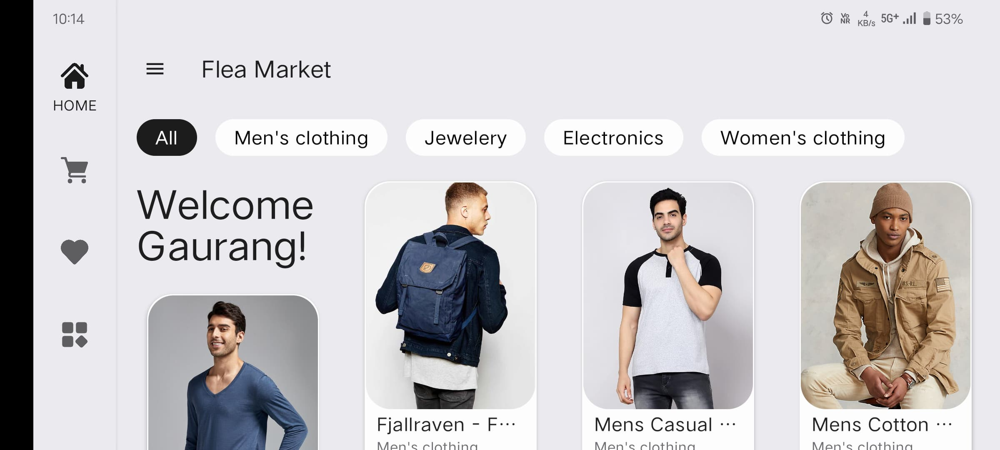
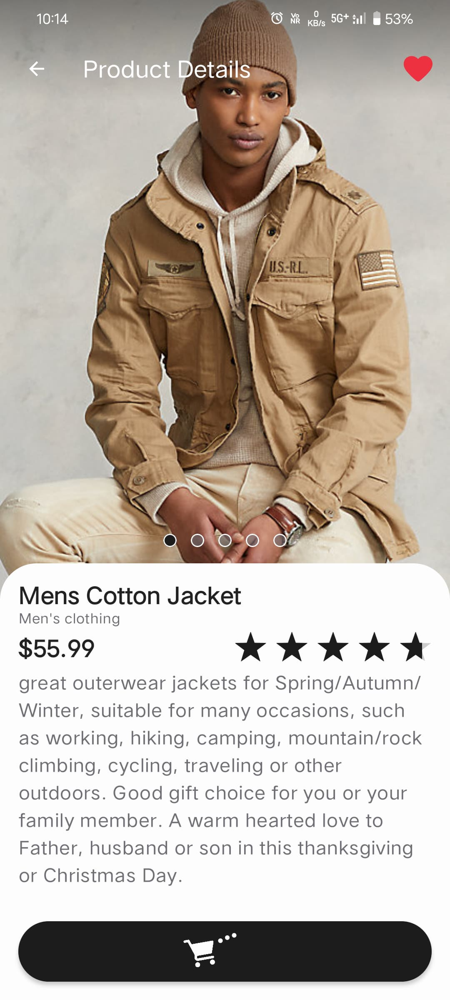
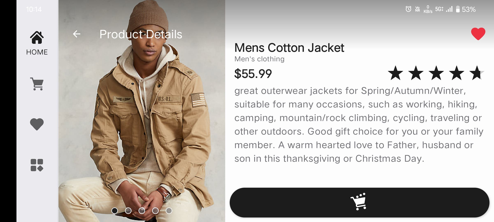
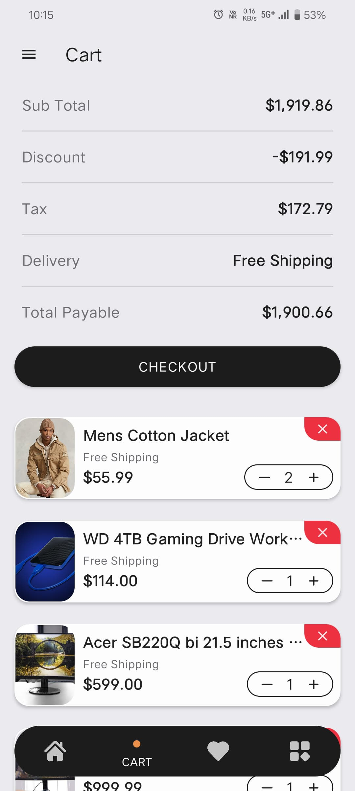
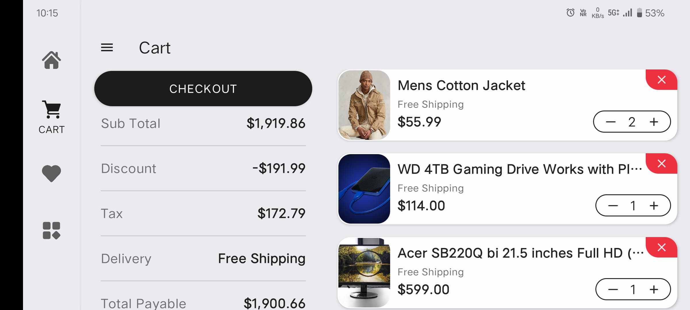
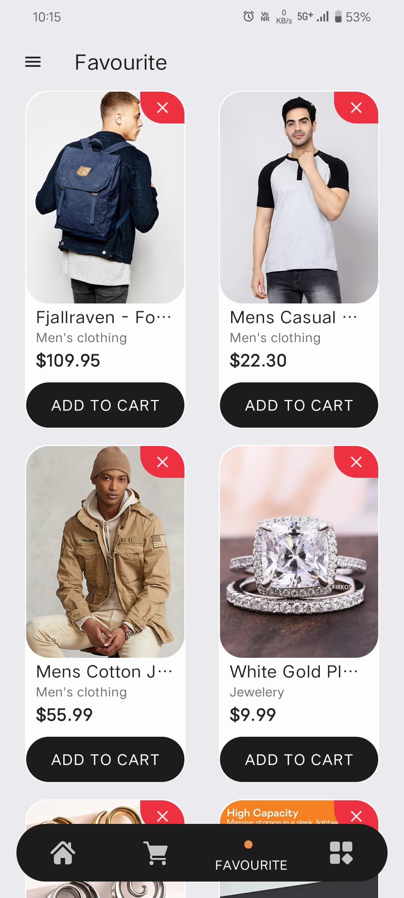
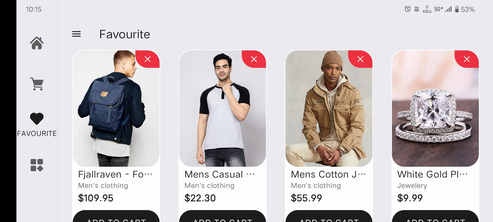
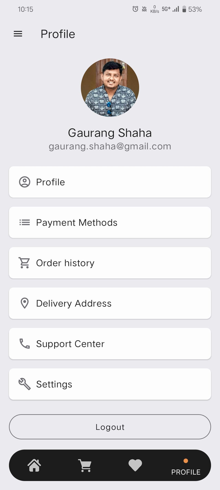
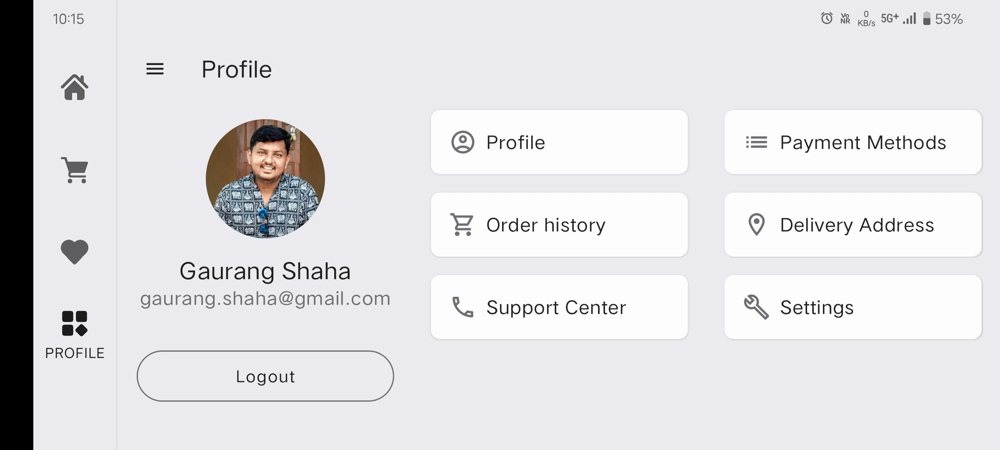

# FleaMarket

FleaMarket is an Android application designed to facilitate the buying and selling of second-hand goods within a community. Users can browse various categories, add items to their cart, and manage their profiles seamlessly. It uses a FakeStoreAPI and local database to achieve the functionality. This application is created as an implementation sample for [BuildingBlocks](https://github.com/GaurangShaha/BuildingBlocks) library.

## APK - [FleaMarket.apk](./images/app-release.apk)

## Features

- **Product Listings**: Browse and search for items across multiple categories.

  
  

- **Product Details**: View detailed information about each product, including descriptions, prices, and images.

  
  

- **Shopping Cart**: Add desired items to your cart for easy checkout.

  
  

- **Favorites**: Mark items as favorites to view them later.

  
  

- **User Profiles**: Manage your profile, view your listings, and track your purchases.

  
  

